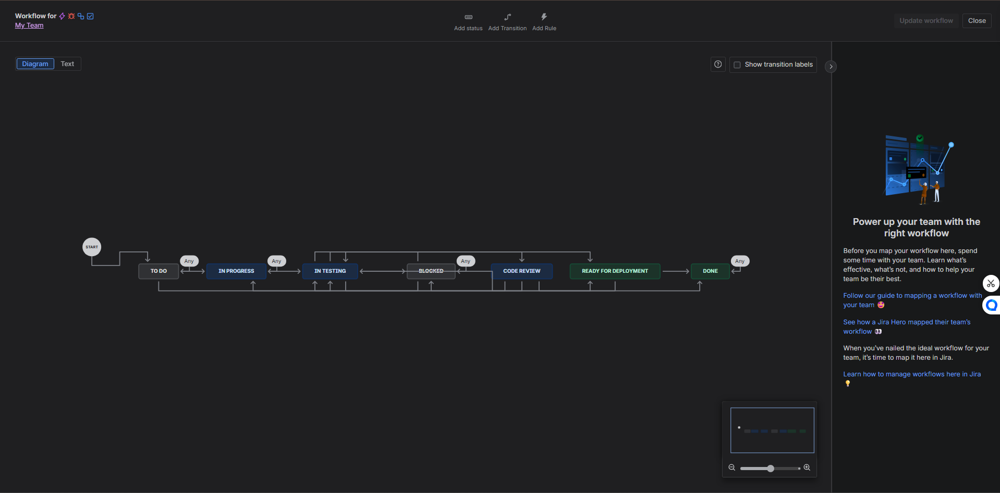
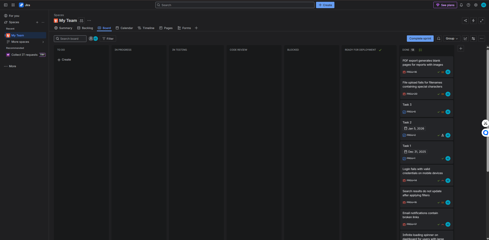
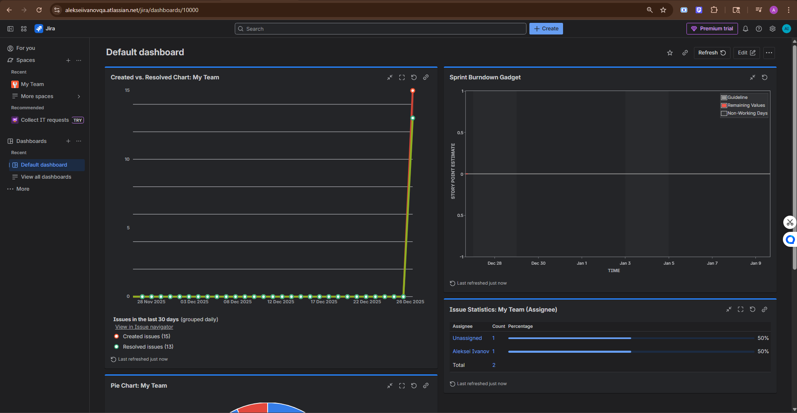
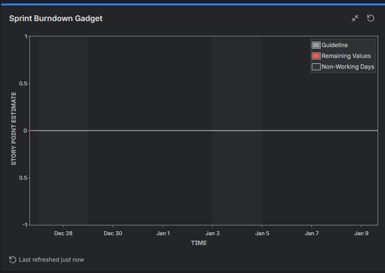

# JIRA + Agile Optimization

**Senior QA Automation Engineer Portfolio Project**

**Aleksei Ivanov** · [aleksei.ivanov.qa@gmail.com](mailto:aleksei.ivanov.qa@gmail.com)

## Overview

Custom JIRA workflow and dashboards demonstrating **20% reduction in test cycle time** through optimized QA processes.

## Features
- Custom statuses: In Testing, Blocked, Code Review, Ready for Deployment
- Clear transitions for QA handoffs
- QA-focused dashboard with burndown, created vs resolved, defect tracking
- Real sprint data

## Results
- Before: Standard workflow — average cycle 10 days
- After: Custom QA workflow + dashboards — average cycle 8 days
- **Test cycle time reduced by 20%**
- Improved visibility and defect tracking

## Screenshots

Live board: https://alekseiivanovqa.atlassian.net/jira/software/projects/PROJ/boards/1

Author: Aleksei Ivanov | 7+ years QA experience